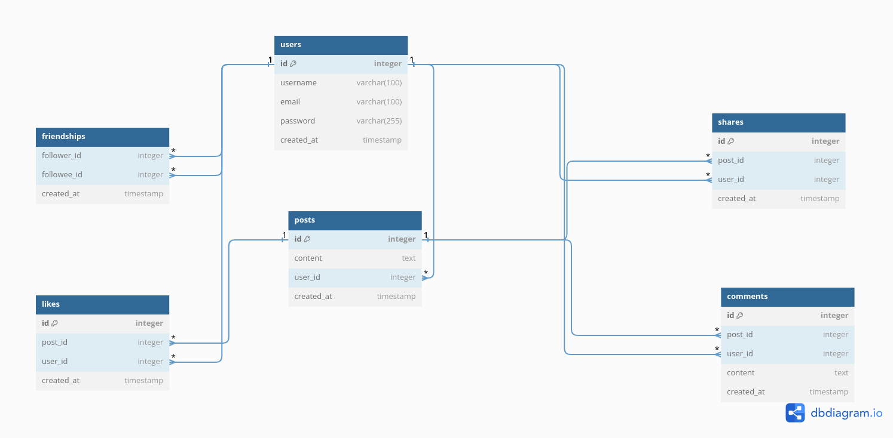

# NewsFeed Flask APP
An API System for managing posts and their comments and likes.

## API Documentation
https://documenter.getpostman.com/view/28439113/2sAXqy1e7b

## ERD Diagram

## Prerequisite

- python (3.x)
- MY SQL

## Installtion

     1- Database Configuration: Create a .env file to configure your database settings.
         - SQL_HOST=localhost
         - SQL_USER= "Your MY SQL USER"
         - SQL_PASSWORD= "Your MY SQL PASSWORD"
         - SQL_DB= "Your MY SQL DATABASE NAME"
         - FLASK_ENV=development

     2- Set Up Virtual Environment:
            - python -m venv venv.
            - source venv/bin/activate  (Linux venv activation)
            - venv/scripts/activate     (Windows venv activation)

     3- Install Dependencies:
           - pip install -r requirements.txt.

     4- Apply tables to your database:
        RUN:
           - flask create-tables
           
              - This a CLI Command that creates tables mentioned you will find the
                Implmentation for it inside models.py file.
                
     5- Run the Development Server:
          flask run
      
